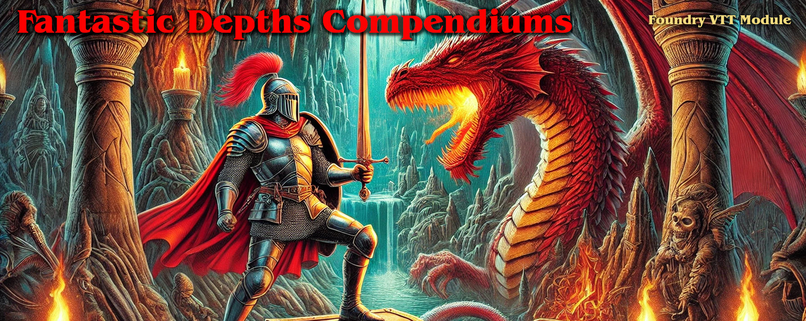

# Fantastic Depths Compendiums

Compendiums module for Fantastic Depths Foundry VTT System.

This module contains compendiums for Fantastic Depths Monsters, Items, Rollable Tables, Skills, Special Abilities, Spells, and more.

Manual Install (Stable): 
https://raw.githubusercontent.com/Forelius/fade-compendiums/refs/heads/stable/module.json

Manual Install (Pre-Release): 
https://raw.githubusercontent.com/Forelius/fade-compendiums/refs/heads/main/module.json

